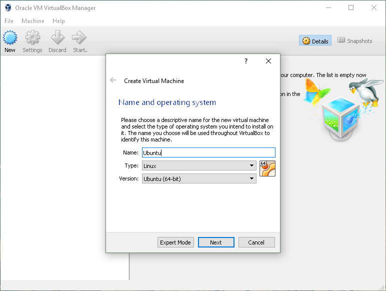
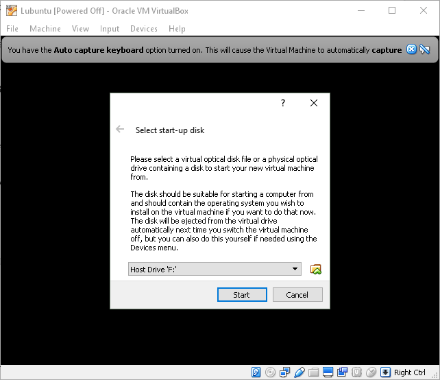
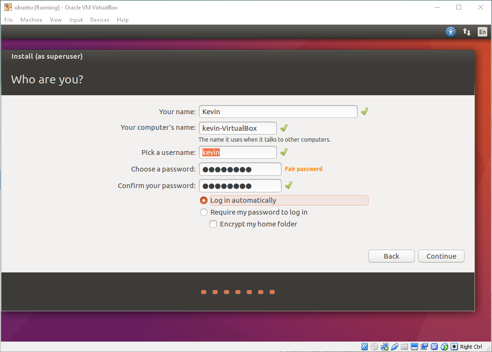
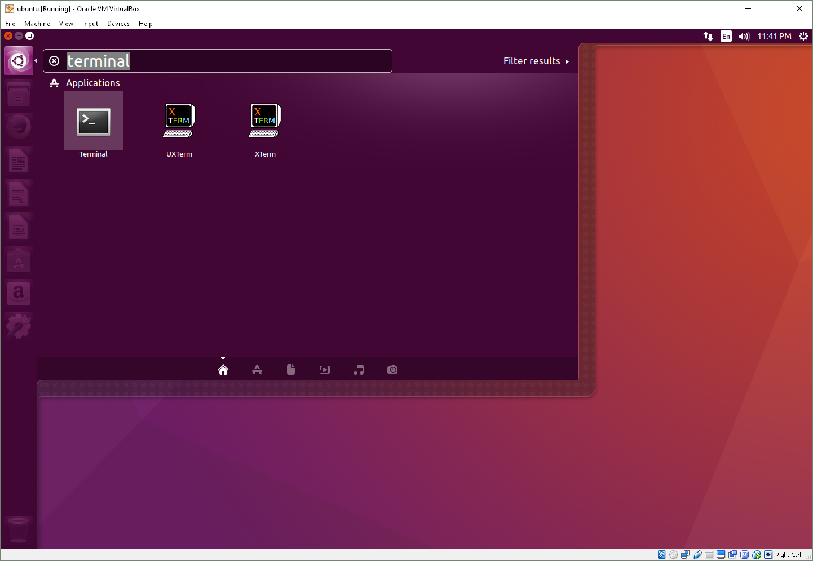

# Technical Requirements
<!-- TOC depthFrom:1 depthTo:6 withLinks:1 updateOnSave:1 orderedList:0 -->
- [Technical Requirements](#technical-requirements)
    - [Introduction & Learning Objectives](#introduction--learning-objectives)
        - [Introduction](#introduction)
        - [Learning Objectives](#learning-objectives)
    - [Installation Instructions for Linux](#installation-instructions-for-linux)
        - [Installing cURL](#installing-curl)
        - [Installing Docker](#installing-docker)
        - [Manage Docker as a Non-Root User](#manage-docker-as-a-non-root-user)
        - [Docker Compose](#docker-compose)
        - [Installing Node.js and npm](#installing-nodejs-and-npm)
        - [Installing Go Language](#installing-go-language)
        - [Ready to Dive into the Hyperledger Frameworks?](#ready-to-dive-into-the-hyperledger-frameworks)
    - [Installation Instructions for MacOS](#installation-instructions-for-macos)
        - [Installing cURL](#installing-curl)
        - [Installing Node.js and npm](#installing-nodejs-and-npm)
        - [Installing Go Language (Part I)](#installing-go-language-part-i)
        - [Installing Go Language (Part II)](#installing-go-language-part-ii)
        - [Downloading Docker](#downloading-docker)
        - [Video: Technical Prerequisites for Mac Users (Demo)](#video-technical-prerequisites-for-mac-users-demo)
            - [Technical Prerequisites for Mac Users (Demo)](#technical-prerequisites-for-mac-users-demo)
        - [Ready to Dive into the Hyperledger Frameworks?](#ready-to-dive-into-the-hyperledger-frameworks)
    - [Installation Instructions for Windows](#installation-instructions-for-windows)
        - [System Requirements](#system-requirements)
        - [Installing VirtualBox and Creating a Virtual Machine](#installing-virtualbox-and-creating-a-virtual-machine)
        - [Downloading and Installing Linux (Part I)](#downloading-and-installing-linux-part-i)
        - [Downloading and Installing Linux (Part II)](#downloading-and-installing-linux-part-ii)
        - [Installing cURL](#installing-curl)
        - [Installing Docker](#installing-docker)
            - [Manage Docker as a non-root user](#manage-docker-as-a-non-root-user)
        - [Docker Compose](#docker-compose)
        - [Installing Node.js and npm](#installing-nodejs-and-npm)
        - [Installing Go Language](#installing-go-language)
        - [Ready to Dive into the Hyperledger Frameworks?](#ready-to-dive-into-the-hyperledger-frameworks)
    - [Learning Objectives (Review)](#learning-objectives-review)
        - [Learning Objectives (Review)](#learning-objectives-review)
<!-- /TOC -->

## Introduction & Learning Objectives

### Introduction

In this section, we will discuss different prerequisites that need to be fulfilled to ensure that our system is prepared for the technical requirements of this course.

Before you proceed to chapters on Hyperledger Iroha, Hyperledger Sawtooth, and Hyperledger Fabric, you have to have the following features installed on your computer: **cURL**, **Node.js**, **npm** package manager, **Go** Language, **Docker**, and **Docker Compose**, and, if you are a Windows user, **VirtualBox**.

If the above have already been installed on your machine, feel free to skip this chapter.

### Learning Objectives

By the end of this chapter you should be able to:
 - Install cURL.
 - Install Node.js and npm package manager.
 - Install Go Language.
 - Install Docker and Docker Compose.
 - Install Virtual Box (if you are a Windows user).

## Installation Instructions for Linux

### Installing cURL

Open a terminal window: **CTRL+ALT+T**.

Type the following command and enter your password:

```
$ sudo apt install curl
```

To check, run the following command in your terminal/command line:

```
$ curl -V
```

**Note**: The "V" is capitalized.

### Installing Docker

Docker provides great instructions on how to install it [here](https://docs.docker.com/install/linux/docker-ce/ubuntu/).

The following directions will assume **64-bit Ubuntu 16.04 VPS**, since it is the simplest way to get Docker.

For Ubuntu, you have the choice between the Community Edition (CE) or the Enterprise Edition (EE). We recommend CE, since it is ideal for developers and small teams looking to experiment with Docker.

### Manage Docker as a Non-Root User

If you don't want to use **sudo** when you use the **docker** command, create a Unix group called **docker** and add users to it. When the **docker** daemon starts, it makes the ownership of the Unix socket read/writable by the **docker** group.

<span style = "color:red">**Warning**</span>: The **docker** group grants privileges equivalent to the **root** user. For details on how this impacts security in your system, see [Docker Daemon Attack Surface](https://docs.docker.com/engine/security/security/#docker-daemon-attack-surface).

To create the **docker** group and add your user:

1. Create the docker group:

```
$ sudo groupadd docker
```

2. Add your user to the **docker** group:

```
$ sudo usermod -aG docker $USER
```

3. Log out and log back in, so that your group membership is re-evaluated.

4. On a desktop Linux environment such as X Windows, log out of your session completely and then log back in.

5. Verify that you can run Docker commands without **sudo**.

```
$ docker run hello-world
```

6. This command downloads a test image and runs it in a container. When the container runs, it prints an informational message and exits.

### Docker Compose

To install Docker Compose, run the following commands in your terminal/command line:

```
$ sudo apt update

$ sudo apt install docker-compose
```

Check to make sure that you have Docker version 17.03.1-ce or greater, and Docker Compose version 1.9.0 or greater:

```
$ docker --version && docker-compose --version
```

### Installing Node.js and npm

To install **Node.js** and **npm**, run the following commands in your terminal/command line:

```bash
$ sudo bash -c "cat >/etc/apt/sources.list.d/nodesource.list" \
deb https://deb.nodesource.com/node_6.x xenial main \
deb-src https://deb.nodesource.com/node_6.x xenial main \
```

```
$ curl -s https://deb.nodesource.com/gpgkey/nodesource.gpg.key | sudo apt-key add -
```

```
$ sudo apt update
```

```
$ sudo apt install nodejs
```

```
$ sudo apt install npm
```

Verify the installation, as well as  the versions of both **Node.js** and npm, and make sure the **Node.js** version you are installing is greater than v6.9 (do not use v7), and the **npm** version is greater than 3.x:

```
$ node --version && npm --version
```

### Installing Go Language

Visit [https://golang.org/dl/](https://golang.org/dl/) and make note of the latest stable release (**v1.8 or later**).

To install Go language, run the following commands in your terminal/command line:

```
$ sudo apt update
```

```
$ sudo curl -O https://storage.googleapis.com/golang/go1.9.2.linux-amd64.tar.gz 
```

**Note**: Switch out the black portion of the URL with the correct filename.

```
$ sudo tar -xvf go1.9.2.linux-amd64.tar.gz
```

```
$ sudo mv go /usr/local
```

```
$ echo 'export PATH=$PATH:/usr/local/go/bin' >> ~/.profile
```

```
$ source ~/.profile
```

Check that the Go version is v1.8 or later:

```
$ go version
```

### Ready to Dive into the Hyperledger Frameworks?

Your Linux system is now ready for the technical chapters on the three Hyperledger frameworks. You can skip the rest of Chapter 4 and go straight to _Chapter 5. Introduction to Hyperledger Iroha_. 

## Installation Instructions for MacOS

### Installing cURL

**cURL** should be installed on your machine by default.

To check, run the following command in your terminal/command line:

```
$ curl -V
```

**Note**: The "V" is capitalized.

### Installing Node.js and npm

Visit [https://nodejs.org/en/download/](https://nodejs.org/en/download/) for details about installing or updating **Node.js** and **npm** for MacOS.

Verify the installation,  as well as the versions of both **Node.js** and npm, and make sure the **Node.js** version you are installing is greater than v6.9 (do not use v7), and the **npm** version is greater than 3.x:

```
$ node --version && npm --version
```

### Installing Go Language (Part I)

Visit [https://golang.org/dl/](https://golang.org/dl/) and make note of the latest stable release (**v1.8 or later**):

```
$ cd ~
```

```
$ sudo curl -O https://storage.googleapis.com/golang/go1.9.2.darwin-amd64.pkg
```

**Note**: Switch out the black portion of the URL with the correct filename.

Open the downloaded file to run the installation package:

```
$ open go1.9.2.darwin-amd64.pkg
```

After completing the installation, **go** will have been installed at **/usr/local/bin/go**. You can check by running:

```
$ which go
```

### Installing Go Language (Part II)

Now, we will need to add **environment variables** to make sure that the source code is located within the **$GOPATH**. You will need to have a single workplace for all your Go projects.

First, you will need to check that you have set your **$GOPATH** environment variable:

```
$ echo $GOPATH
```

And you should get the following response:

```
/Users/xxx/go
```

If there is no response, you will tell Go the location of our chosen workspace, by modifying the **.profile** file located in your home directory:

```
$ nano ~/.profile
```

**Note**: If you want, you can use _vim_ or _vi_ to edit this file, instead of _nano_.

Within this file, add the following two lines, to export the required variables:

```
$ export GOPATH=$HOME/go
```

```
$ export PATH=$PATH:$GOPATH/bin
```

**Note**: To save in _nano_, press **Control + O** and then, press **Enter**.

**Note**: To exit and navigate back to clear shell, press **Control + x**.

Rerun **.profile** to run these new paths:

```
$ source .profile
```

Check that the Go version is v1.8 or later:

```
$ go version
```

### Downloading Docker

To download Docker, you are required to have OSX Yosemite 10.10.3, or above. Otherwise, for previous OS versions, you should download [Docker Toolbox](https://www.docker.com/products/docker-desktop).

**Note**: Installing Docker for Mac or Docker Toolbox will also install Docker Compose. If you already have Docker installed, you should check that you have Docker Compose version 1.9.0 or greater installed. If not, we recommend that you install a more recent version of Docker.

This VM will host the Hyperledger Fabric peers and other network nodes.

Visit [https://www.docker.com/docker-mac](https://www.docker.com/docker-mac) and click "Download from Docker Store".

Check to make sure that you have version 17.03.1-ce or greater:

```
$ docker --version && docker-compose --version
```

### Video: Technical Prerequisites for Mac Users (Demo)

#### Technical Prerequisites for Mac Users (Demo)

[](https://youtu.be/rNC1kp--QFc)

### Ready to Dive into the Hyperledger Frameworks?

Your MacOS is now ready for the technical chapters on the three Hyperledger frameworks. You can skip the rest of Chapter 4 and go straight to _Chapter 5. Introduction to Hyperledger Iroha_.

## Installation Instructions for Windows

Please note you must not have Docker for Windows installed, or HyperV enabled for VirtualBox to run. See [here](http://www.poweronplatforms.com/enable-disable-hyper-v-windows-10-8/) on how to disable HyperV.

### System Requirements

Below are the expected requirements for Ubuntu 16.04, which we will be downloading on our virtual machine:
 - 2 GHz dual core processor or better
 - 2 GB system memory
 - 25 GB of free hard drive space
 - Either a DVD drive or a USB port for the installer media.

### Installing VirtualBox and Creating a Virtual Machine

Download and install the latest VirtualBox platform packages from [here](https://www.virtualbox.org/wiki/Downloads). Once installed, you will be greeted by a screen similar to the one presented below.

||
|:--:|
| *Licensed under [CC By 4.0](https://creativecommons.org/licenses/by/4.0/)* |

Click "New" to create a new virtual machine. At this point, you will need to choose a Linux distribution to install. Many Linux distributions will work for this tutorial, but we recommend using **Ubuntu 16.04**, which is a very popular one.

Take note of the version selected. If you are sticking with our recommendation of Ubuntu, you should select **Ubuntu (64-bit)**.

For the rest of the setup, use the following options:
 - 2 GHz dual core processor or better
 - 2 GB system memory
 - 25 GB of free hard drive space
 - Either a DVD drive or a USB port for the installer media.

### Downloading and Installing Linux (Part I)

Before starting the virtual machine, you will need to install your Linux distribution.

If using Ubuntu, please download the 16.04 desktop version [here](http://releases.ubuntu.com/xenial/ubuntu-16.04.5-desktop-amd64.iso).

Once the image file download is complete, click "Start" to boot your virtual machine.

||
|:--:|
| *Licensed under [CC By 4.0](https://creativecommons.org/licenses/by/4.0/)* |

Use the folder icon to browse for and open the image file you just downloaded, and click "Start". Follow the install prompts to install Linux.

||
|:--:|
| *Licensed under [CC By 4.0](https://creativecommons.org/licenses/by/4.0/)* |

Grab a coffee! It may take a few minutes to install. Restart when prompted.

### Downloading and Installing Linux (Part II)

To open a terminal, you can press **CTRL+ALT+T**, or find it by clicking the Ubuntu Home button and searching for 'terminal'.

You can now browse the web, download/install any Ubuntu software and, most importantly, continue the tutorial! Good luck!

For more help on VirtualBox, check out their excellent manual [here](https://www.virtualbox.org/manual/).

||
|:--:|
| *Licensed under [CC By 4.0](https://creativecommons.org/licenses/by/4.0/)* |

### Installing cURL

Open a terminal window: **CTRL+ALT+T**.

Type the following command and enter your password:

```
$ sudo apt install curl
```

To check, run the following command in your terminal/command line:

```
$ curl -V
```

**Note**: The "V" is capitalized.

### Installing Docker

Docker provides great instructions on how to install it [here](https://docs.docker.com/install/linux/docker-ce/ubuntu/).

#### Manage Docker as a non-root user

If you don't want to use **sudo** when you use the **docker** command, create a Unix group called **docker** and add users to it. When the **docker** daemon starts, it makes the ownership of the Unix socket read/writable by the **docker** group.

<span style = "color:red">**Warning**</span>: The **docker** group grants privileges equivalent to the **root** user. For details on how this impacts security in your system, see [Docker Daemon Attack Surface](https://docs.docker.com/engine/security/security/#docker-daemon-attack-surface).

To create the **docker** group and add your user:

1. Create the docker group:

```
$ sudo groupadd docker
```

2. Add your user to the **docker** group:

```
$ sudo usermod -aG docker $USER
```

3. Log out and log back in, so that your group membership is re-evaluated.

4. On a desktop Linux environment such as X Windows, log out of your session completely and then log back in.

5. Verify that you can run Docker commands without **sudo**.

```
$ docker run hello-world
```

6. This command downloads a test image and runs it in a container. When the container runs, it prints an informational message and exits.

### Docker Compose

To install Docker Compose, run the following commands in your terminal/command line:

```
$ sudo apt update
```

```
$ sudo apt install docker-compose
```

Check to make sure that you have Docker version 17.03.1-ce or greater, and Docker Compose version 1.9.0 or greater:

```
$ docker --version && docker-compose --version
```

### Installing Node.js and npm

To install **Node.js** and **npm**, run the following commands in your terminal/command line:

```bash
$ sudo bash -c "cat >/etc/apt/sources.list.d/nodesource.list" \
deb https://deb.nodesource.com/node_6.x xenial main \
deb-src https://deb.nodesource.com/node_6.x xenial main \
```

```
$ curl -s https://deb.nodesource.com/gpgkey/nodesource.gpg.key | sudo apt-key add -
```

```
$ sudo apt update
```

```
$ sudo apt install nodejs
```

```
$ sudo apt install npm
```

Verify the installation, as well as  the versions of both **Node.js** and npm, and make sure the **Node.js** version you are installing is greater than v6.9 (do not use v7), and the **npm** version is greater than 3.x:

```
$ node --version && npm --version
```

### Installing Go Language

Visit [https://golang.org/dl/](https://golang.org/dl/) and make note of the latest stable release (**v1.8 or later**).

To install Go language, run the following commands in your terminal/command line:

```
$ sudo apt update
```

```
$ sudo curl -O https://storage.googleapis.com/golang/go1.9.2.linux-amd64.tar.gz 
```

**Note**: Switch out the black portion of the URL with the correct filename.

```
$ sudo tar -xvf go1.9.2.linux-amd64.tar.gz
```

```
$ sudo mv go /usr/local
```

```
$ echo 'export PATH=$PATH:/usr/local/go/bin' >> ~/.profile
```

```
$ source ~/.profile
```

Check that the Go version is v1.8 or later:

```
$ go version
```

### Ready to Dive into the Hyperledger Frameworks?

Your Windows system is now ready for the technical chapters on the three Hyperledger frameworks. You can skip the rest of Chapter 4 and go straight to _Chapter 5. Introduction to Hyperledger Iroha_.

## Learning Objectives (Review)

### Learning Objectives (Review)

You should now be able to:
 - Install cURL.
 - Install Node.js and npm package manager.
 - Install Go Language.
 - Install Docker and Docker Compose.
 - Install Virtual Box (if you are a Windows user).
 
